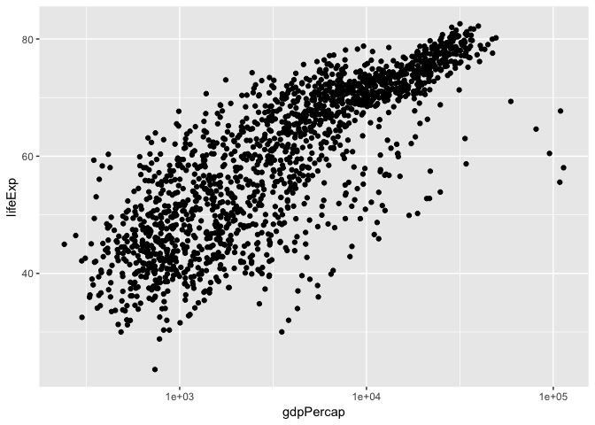
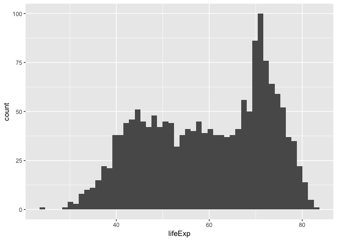
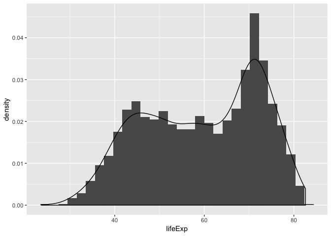
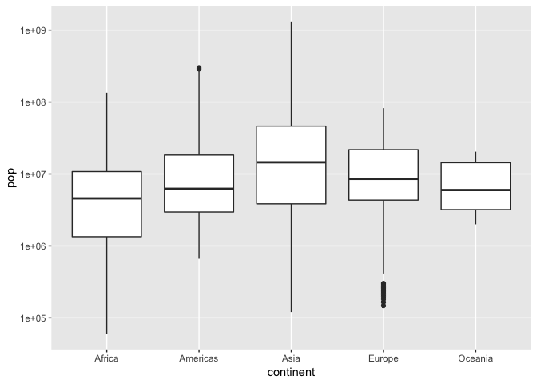
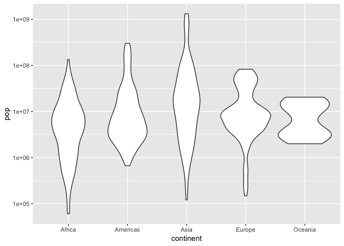
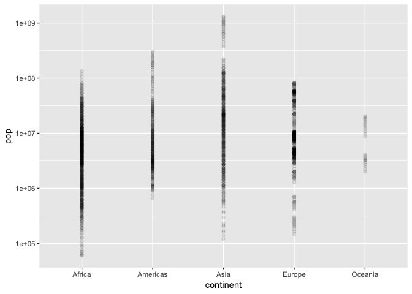
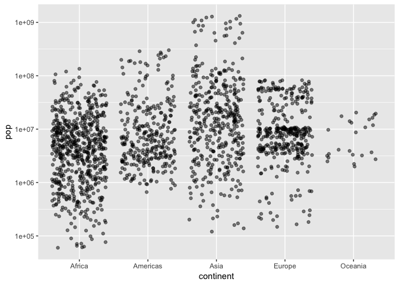
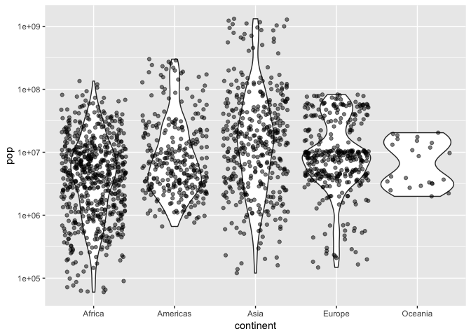
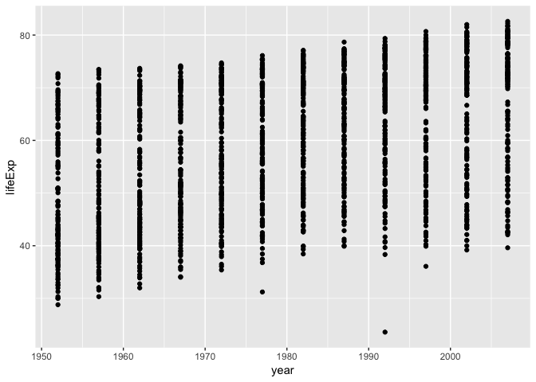
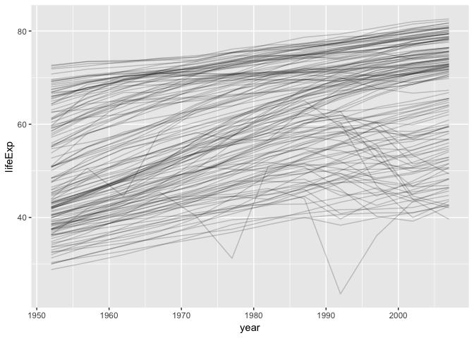

cm006 Exercises: Exploring Geometric Objects
================

In this worksheet, we'll be exploring various plot types (i.e., geometric objects), only using the `x` and `y` aesthetics (and `group`).

1.  To get started, load the `tidyverse` and `gapminder` R packages.

``` r
library(tidyverse)
```

    ## ── Attaching packages ───────────────────────────────────────────────────────────── tidyverse 1.2.1 ──

    ## ✔ ggplot2 3.0.0     ✔ purrr   0.2.5
    ## ✔ tibble  1.4.2     ✔ dplyr   0.7.6
    ## ✔ tidyr   0.8.1     ✔ stringr 1.3.1
    ## ✔ readr   1.1.1     ✔ forcats 0.3.0

    ## ── Conflicts ──────────────────────────────────────────────────────────────── tidyverse_conflicts() ──
    ## ✖ dplyr::filter() masks stats::filter()
    ## ✖ dplyr::lag()    masks stats::lag()

``` r
library(gapminder)
```

Scatterplot
-----------

Let's look at a *scatterplot* of `gdpPercap` vs. `lifeExp`.

1.  Fill out the grammar components below. Again, bold *must* be specified to make a `ggplot2` plot.
    -   We'll ignore "coordinate system" and "facetting" after this.

| Grammar Component     | Specification |
|-----------------------|---------------|
| **data**              | `gapminder`   |
| **aesthetic mapping** | `x` and `y`   |
| **geometric object**  | points        |
| scale                 | linear        |
| statistical transform | none          |
| coordinate system     | rectangular   |
| facetting             | none          |

1.  Populate the data and aesthetic mapping in `ggplot`. What is returned? What's missing?

``` r
ggplot(gapminder, aes(x=gdpPercap, y=lifeExp)) +
  geom_point()
```


1.  Add the missing component as a *layer*.

Notice the "metaprogramming" again!

1.  You *must* remember to put the aesthetic mappings in the `aes` function! What happens if you forget?

``` r
ggplot(gapminder, aes(x=gdpPercap, y=lifeExp)) +
  geom_point()
```


1.  Put the x-axis on a log scale, first by transforming the x variable.
    -   Note: `ggplot2` does some data wrangling and computations itself! We don't always have to modify the data frame.

``` r
ggplot(gapminder, aes(x=log(gdpPercap), y=lifeExp)) +
  geom_point()
```


1.  Try again, this time by changing the *scale* (this way is better).

``` r
ggplot(gapminder, aes(x=gdpPercap, y=lifeExp)) +
  geom_point() +
  scale_x_log10()
```



1.  The aesthetic mappings can be specified on the geom layer if you want, instead of the main `ggplot` call. Give it a try:

``` r
gapminder %>% 
  ggplot(aes(x=gdpPercap, y=lifeExp)) +
  geom_point()
```


1.  Optional: git stage and commit

**Uses of a scatterplot**:

-   Visualize 2-dimensional distributions; dependence.
-   2 numeric variables

Histograms, and Kernel Density Plots
------------------------------------

Let's build a histogram of life expectancy.

1.  Fill out the grammar components below. Again, bold *must* be specified to make a `ggplot2` plot.

| Grammar Component     | Specification |
|-----------------------|---------------|
| **data**              | `gapminder`   |
| **aesthetic mapping** |               |
| **geometric object**  |               |
| scale                 |               |
| statistical transform |               |

1.  Build the histogram of life expectancy.

``` r
ggplot(gapminder, aes(lifeExp)) +
  geom_histogram(bins=50)
```



1.  Change the number of bins to 50.

2.  Instead of a histogram, let's create a kernel density plot.

``` r
ggplot(gapminder, aes(lifeExp)) +
  geom_histogram(aes(y=..density..)) +
  geom_density()
```

    ## `stat_bin()` using `bins = 30`. Pick better value with `binwidth`.



How to make second axis

"p &lt;- ggplot(obs, aes(x = Timestamp)) p &lt;- p + geom\_line(aes(y = air\_temp, colour = "Temperature"))

\# adding the relative humidity data, transformed to match roughly the range of the temperature p &lt;- p + geom\_line(aes(y = rel\_hum/5, colour = "Humidity"))

\# now adding the secondary axis, following the example in the help file ?scale\_y\_continuous \# and, very important, reverting the above transformation p &lt;- p + scale\_y\_continuous(sec.axis = sec\_axis(~.\*5, name = "Relative humidity \[%\]"))

\# modifying colours and theme options p &lt;- p + scale\_colour\_manual(values = c("blue", "red")) p &lt;- p + labs(y = "Air temperature \[°C\]", x = "Date and time", colour = "Parameter") p &lt;- p + theme(legend.position = c(0.8, 0.9)) p"

1.  Optional: git stage and commit

**Uses of a histogram**: Explore the distribution of a single numeric variable.

Box plots, and violin plots
---------------------------

Let's make *box plots* of population for each continent. Note: y-axis is much better on a log scale!

1.  Fill out the grammar components below. Again, bold *must* be specified to make a `ggplot2` plot.

| Grammar Component     | Specification    |
|-----------------------|------------------|
| **data**              | `gapminder`      |
| **aesthetic mapping** | `x` and `y`      |
| **geometric object**  | boxplot          |
| scale                 | log y scale      |
| statistical transform | 5-number summary |

1.  Initiate the `ggplot` call, with the log y scale, and store it in the variable `a`. Print out `a`.

``` r
a <- ggplot(gapminder, aes(x=continent, y=pop)) +
      scale_y_log10()

a + geom_boxplot()
```



1.  Add the boxplot geom to `a`.

2.  A violin plot is a kernel density on its side, made symmetric. Add that geom to `a`.
    -   What's better here, boxplots or violin plots? Why?

``` r
a + geom_violin()
```



1.  Optional: git stage and commit

**Use of boxplot**: Visualize 1-dimensional distributions (of a single numeric variable).

Jitter plots
------------

Let's work up to the concept of a *jitter plot*. As above, let's explore the population for each continent, but using points (again, with the y-axis on a log scale).

Let's hold off on identifying the grammar.

1.  Initiate the `ggplot` call to make a scatterplot of `continent` vs `pop`; initiate the log y scale. Store the call in the variable `b`.

``` r
a + geom_point(alpha = .1)
```



1.  Add the point geom to `b`. Why is this an ineffective plot?

2.  A solution is to jitter the points. Add the jitter geom. Re-run the command a few times -- does the plot change? Why?

``` r
a + geom_jitter(alpha = 0.5)
```



1.  How does the grammar differ from a box plot or violin plot?
    -   ANSWER:
2.  We can add multiple geom *layers* to our plot. Put a jitterplot overtop of the violin plot, starting with our base `b`. Try vice-versa.

``` r
a + geom_violin() + geom_jitter(alpha = 0.5)
```



``` r
#Gives you an idea of the distribution of points, and an idea of the number of points#
```

1.  Optional: git stage and commit

**Uses of jitterplot**: Visualize 1-dimensional distributions, AND get a sense of the sample size.

Time/Line Plots
---------------

Let's make some time/line plot, starting with Canada's life expectancy over time.

1.  Fill out the grammar components below. Again, bold *must* be specified to make a `ggplot2` plot.

| Grammar Component     | Specification |
|-----------------------|---------------|
| **data**              | `gapminder`   |
| **aesthetic mapping** | `x` and `y`   |
| **geometric object**  | line          |
| scale                 |               |
| statistical transform |               |

1.  In one readable call, write code that:
    1.  Filters the data to Canada only
    2.  Pipes the filtered data into `ggplot`
    3.  Makes the time plot of `lifeExp` over time
    4.  Also displays the points

``` r
gapminder %>% 
  filter(country == "Canada") %>% 
  ggplot(aes(x=year, y=lifeExp)) +
  geom_point() +
  geom_line()
```


1.  Attempt to overlay line plots for all countries. That is, repeat the above code, but don't filter. What's wrong here?

2.  Use the `group` aesthetic to fix the problem.

``` r
c <- ggplot(gapminder, aes(x=year, y=lifeExp))
c + geom_point()
```



``` r
c +  geom_line(aes(group=country), alpha = .2)
```



1.  Optional: git stage and commit

**Uses of time/line plots**: Visualize trends of a numeric variable over time.

Path plots
----------

Let's see how Rwanda's life expectancy and GDP per capita have evolved over time, using a path plot.

1.  Make a scatterplot. Store it in the variable `c`.

2.  We want to connect the dots from earliest point to latest. What happens if we add the "line" geom to `c`?

3.  Add the appropriate geom to `c`. In that geom, specify a property of the geom: `arrow=arrow()`.

4.  Optional: git stage and commit

**Uses of path plots**: The four "corners" of the plot usually indicate different qualities. This plot allows you to see how Rwanda (or some entity) evolves over these qualities.

Bar plots
---------

How many countries are in each continent? Use the year 2007.

1.  Fill out the grammar components below. Again, bold *must* be specified to make a `ggplot2` plot.

| Grammar Component     | Specification |
|-----------------------|---------------|
| **data**              | `gapminder`   |
| **aesthetic mapping** |               |
| **geometric object**  |               |
| scale                 |               |
| statistical transform |               |

1.  After filtering the gapminder data to 2007, make a bar chart of the number of countries in each continent. Store everything except the geom in the variable `d`.

2.  Notice the y-axis. Oddly, `ggplot2` doesn't make it obvious how to change to proportion. Try adding a `y` aesthetic: `y=..count../sum(..count..)`.

3.  Optional: git stage, commit, and push!

**Uses of bar plots**: Get a sense of relative quantities of categories, or see the probability mass function of a categorical random variable.
