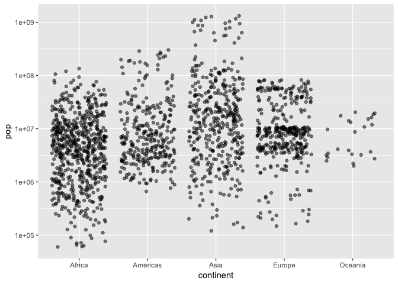

In this worksheet, we'll be exploring various plot types (i.e., geometric objects), only using the `x` and `y` aesthetics (and `group`).

1. To get started, load the `tidyverse` and `gapminder` R packages. 


```r
library(tidyverse)
```

```
## ── Attaching packages ───────────────────────────────────────────────────────────── tidyverse 1.2.1 ──
```

```
## ✔ ggplot2 3.0.0     ✔ purrr   0.2.5
## ✔ tibble  1.4.2     ✔ dplyr   0.7.6
## ✔ tidyr   0.8.1     ✔ stringr 1.3.1
## ✔ readr   1.1.1     ✔ forcats 0.3.0
```

```
## ── Conflicts ──────────────────────────────────────────────────────────────── tidyverse_conflicts() ──
## ✖ dplyr::filter() masks stats::filter()
## ✖ dplyr::lag()    masks stats::lag()
```

```r
library(gapminder)
```


## Scatterplot

Let's look at a _scatterplot_ of `gdpPercap` vs. `lifeExp`. 

1. Fill out the grammar components below. Again, bold _must_ be specified to make a `ggplot2` plot.
    - We'll ignore "coordinate system" and "facetting" after this.

| Grammar Component     | Specification |
|-----------------------|---------------|
| __data__              | `gapminder` |
| __aesthetic mapping__ | `x` and `y` |
| __geometric object__  |  points |
| scale                 |  linear |
| statistical transform |  none |
| coordinate system     |  rectangular|
| facetting             | none |

2. Populate the data and aesthetic mapping in `ggplot`. What is returned? What's missing?


```r
ggplot(gapminder, aes(x=gdpPercap, y=lifeExp)) +
  geom_point()
```


3. Add the missing component as a _layer_.


Notice the "metaprogramming" again!

4. You _must_ remember to put the aesthetic mappings in the `aes` function! What happens if you forget?


```r
ggplot(gapminder, aes(x=gdpPercap, y=lifeExp)) +
  geom_point()
```


5. Put the x-axis on a log scale, first by transforming the x variable. 
    - Note: `ggplot2` does some data wrangling and computations itself! We don't always have to modify the data frame.


```r
ggplot(gapminder, aes(x=log(gdpPercap), y=lifeExp)) +
  geom_point()
```


6. Try again, this time by changing the _scale_ (this way is better).


```r
ggplot(gapminder, aes(x=gdpPercap, y=lifeExp)) +
  geom_point() +
  scale_x_log10()
```


7. The aesthetic mappings can be specified on the geom layer if you want, instead of the main `ggplot` call. Give it a try:


```r
gapminder %>% 
  ggplot(aes(x=gdpPercap, y=lifeExp)) +
  geom_point()
```


8. Optional: git stage and commit

__Uses of a scatterplot__: 

- Visualize 2-dimensional distributions; dependence.
- 2 numeric variables

## Histograms, and Kernel Density Plots

Let's build a histogram of life expectancy.

1. Fill out the grammar components below. Again, bold _must_ be specified to make a `ggplot2` plot.

| Grammar Component     | Specification |
|-----------------------|---------------|
| __data__              | `gapminder` |
| __aesthetic mapping__ |  |
| __geometric object__  |  |
| scale                 |  |
| statistical transform |  |

2. Build the histogram of life expectancy.


```r
ggplot(gapminder, aes(lifeExp)) +
  geom_histogram(bins=50)
```


3. Change the number of bins to 50.


4. Instead of a histogram, let's create a kernel density plot.


```r
ggplot(gapminder, aes(lifeExp)) +
  geom_histogram(aes(y=..density..)) +
  geom_density()
```

```
## `stat_bin()` using `bins = 30`. Pick better value with `binwidth`.
```


How to make second axis

"p <- ggplot(obs, aes(x = Timestamp))
  p <- p + geom_line(aes(y = air_temp, colour = "Temperature"))
  
  # adding the relative humidity data, transformed to match roughly the range of the temperature
  p <- p + geom_line(aes(y = rel_hum/5, colour = "Humidity"))
  
  # now adding the secondary axis, following the example in the help file ?scale_y_continuous
  # and, very important, reverting the above transformation
  p <- p + scale_y_continuous(sec.axis = sec_axis(~.*5, name = "Relative humidity [%]"))
  
  # modifying colours and theme options
  p <- p + scale_colour_manual(values = c("blue", "red"))
  p <- p + labs(y = "Air temperature [°C]",
                x = "Date and time",
                colour = "Parameter")
  p <- p + theme(legend.position = c(0.8, 0.9))
p"


5. Optional: git stage and commit

__Uses of a histogram__: Explore the distribution of a single numeric variable.


## Box plots, and violin plots

Let's make _box plots_ of population for each continent. Note: y-axis is much better on a log scale!

1. Fill out the grammar components below. Again, bold _must_ be specified to make a `ggplot2` plot.

| Grammar Component     | Specification |
|-----------------------|---------------|
| __data__              | `gapminder` |
| __aesthetic mapping__ | `x` and `y`|
| __geometric object__  |  boxplot |
| scale                 |  log y scale|
| statistical transform |  5-number summary |

2. Initiate the `ggplot` call, with the log y scale, and store it in the variable `a`. Print out `a`.


```r
a <- ggplot(gapminder, aes(x=continent, y=pop)) +
      scale_y_log10()

a + geom_boxplot()
```


3. Add the boxplot geom to `a`.


4. A violin plot is a kernel density on its side, made symmetric. Add that geom to `a`.
    - What's better here, boxplots or violin plots? Why?


```r
a + geom_violin()
```


5. Optional: git stage and commit

__Use of boxplot__: Visualize 1-dimensional distributions (of a single numeric variable).

## Jitter plots

Let's work up to the concept of a _jitter plot_. As above, let's explore the population for each continent, but using points (again, with the y-axis on a log scale).

Let's hold off on identifying the grammar. 

1. Initiate the `ggplot` call to make a scatterplot of `continent` vs `pop`; initiate the log y scale. Store the call in the variable `b`.


```r
a + geom_point(alpha = .1)
```


2. Add the point geom to `b`. Why is this an ineffective plot?


3. A solution is to jitter the points. Add the jitter geom. Re-run the command a few times -- does the plot change? Why?


```r
a + geom_jitter(alpha = 0.5)
```




4. How does the grammar differ from a box plot or violin plot?
    - ANSWER: 

5. We can add multiple geom _layers_ to our plot. Put a jitterplot overtop of the violin plot, starting with our base `b`. Try vice-versa. 


```r
a + geom_violin() + geom_jitter(alpha = 0.5)
```


```r
#Gives you an idea of the distribution of points, and an idea of the number of points#
```


6. Optional: git stage and commit

__Uses of jitterplot__: Visualize 1-dimensional distributions, AND get a sense of the sample size.

## Time/Line Plots

Let's make some time/line plot, starting with Canada's life expectancy over time.

1. Fill out the grammar components below. Again, bold _must_ be specified to make a `ggplot2` plot.

| Grammar Component     | Specification |
|-----------------------|---------------|
| __data__              | `gapminder` |
| __aesthetic mapping__ |  `x` and `y`|
| __geometric object__  |  line |
| scale                 |  |
| statistical transform |  |

2. In one readable call, write code that:
    1. Filters the data to Canada only
    2. Pipes the filtered data into `ggplot`
    3. Makes the time plot of `lifeExp` over time
    4. Also displays the points


```r
gapminder %>% 
  filter(country == "Canada") %>% 
  ggplot(aes(x=year, y=lifeExp)) +
  geom_point() +
  geom_line()
```


3. Attempt to overlay line plots for all countries. That is, repeat the above code, but don't filter. What's wrong here?

4. Use the `group` aesthetic to fix the problem.


```r
c <- ggplot(gapminder, aes(x=year, y=lifeExp))
c + geom_point()
```


```r
c +  geom_line(aes(group=country), alpha = .2)
```


5. Optional: git stage and commit

__Uses of time/line plots__: Visualize trends of a numeric variable over time.

## Path plots

Let's see how Rwanda's life expectancy and GDP per capita have evolved over time, using a path plot.

1. Make a scatterplot. Store it in the variable `c`. 


2. We want to connect the dots from earliest point to latest. What happens if we add the "line" geom to `c`?


3. Add the appropriate geom to `c`. In that geom, specify a property of the geom: `arrow=arrow()`. 


4. Optional: git stage and commit

__Uses of path plots__: The four "corners" of the plot usually indicate different qualities. This plot allows you to see how Rwanda (or some entity) evolves over these qualities.

## Bar plots

How many countries are in each continent? Use the year 2007.

1. Fill out the grammar components below. Again, bold _must_ be specified to make a `ggplot2` plot.

| Grammar Component     | Specification |
|-----------------------|---------------|
| __data__              | `gapminder` |
| __aesthetic mapping__ |  |
| __geometric object__  |  |
| scale                 |  |
| statistical transform |  |

2. After filtering the gapminder data to 2007, make a bar chart of the number of countries in each continent. Store everything except the geom in the variable `d`.


3. Notice the y-axis. Oddly, `ggplot2` doesn't make it obvious how to change to proportion. Try adding a `y` aesthetic: `y=..count../sum(..count..)`.


4. Optional: git stage, commit, and push!

__Uses of bar plots__: Get a sense of relative quantities of categories, or see the probability mass function of a categorical random variable.
